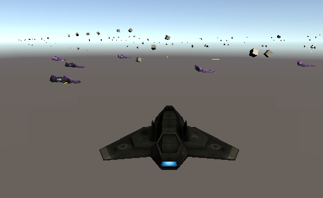

[This link goes to my little game with SPACE-SHIPs](/game-SpaceShips/) and lasers.

It should work in any WebGL browser.
It's not very robust because ... well ... sharing it was an afterthought.

* W-A-S-D along with the arrow keys fly the SPACE-SHIP around.
  * That's a lie - trying to go backwards does nothing
* when you're trying to go forwards you won't slow down
  * ... because when you step on the gas the game removes your inertial drag
* once you stop pushing forwards - you'll slow down
  * ... so if you're going sideways, let go of the gas for a moment and you'll stop then step on it when you've stopped
* the same rules apply to turning
  * spin spin spin! but release the key when you want to stop spinning
* you can shoot with SPACEBAR LEFT-MOUSE or the LEFT-CONTROL key

[Have Fun](/game-SpaceShips/)
